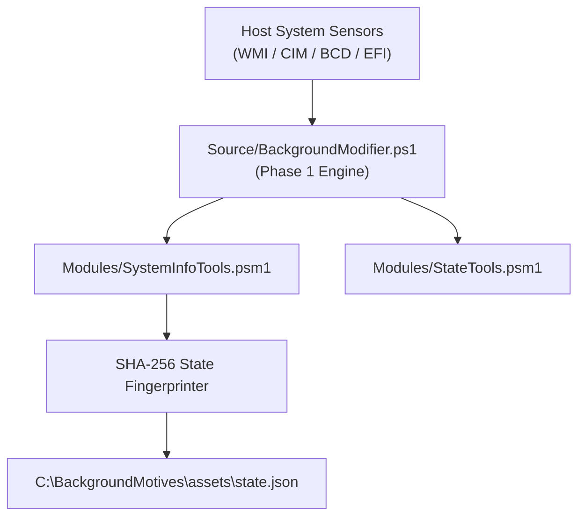

# App: 1 - System Identity & State Capture Engine Architecture

### 1. Architectural Concept & End-User Perspective
App 1 acts as the pre-logon system telemetry sensor and identity recorder. Running in elevated system context during Phase 1 (pre-logon) or autorun discovery, it gathers volatile and non-volatile host attributes—including BIOS/UEFI labels, BCD configuration, kernel boot timestamp (`lastBootTime`), IP addresses, OS version, and multi-drive volume inventory. It computes a cryptographically stable SHA-256 fingerprint of the host state, serializing the resulting payload into `C:\BackgroundMotives\assets\state.json`.

### 2. User Mental Model & Topology

---
