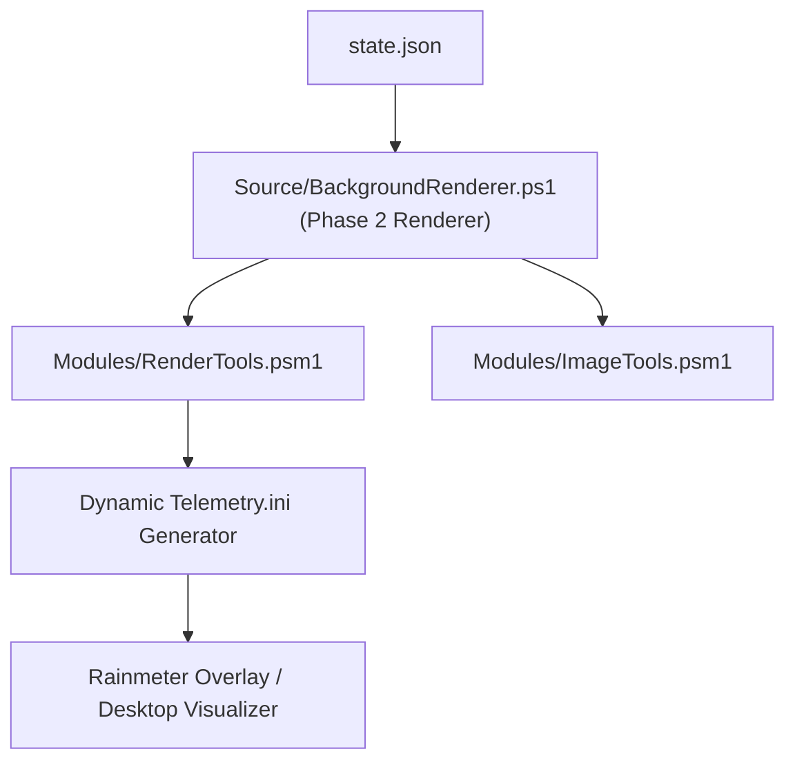

# App: 2 - Telemetry Rendering & Skin Engine Architecture

### 1. Architectural Concept & End-User Perspective
App 2 translates serialized system telemetry into visual representations. Under the dynamic Rainmeter skin architecture, it generates custom `.ini` meter blocks positioned precisely in screen zones without overlapping desktop icons or taskbars. It supports dynamic multi-drive scaling (monitoring 13+ drives with usage alerts) and triggers Rainmeter `!Refresh` bangs only when system state or volume metrics change, eliminating CPU/GPU rendering overhead and bitmap thrashing.

### 2. User Mental Model & Topology

---
