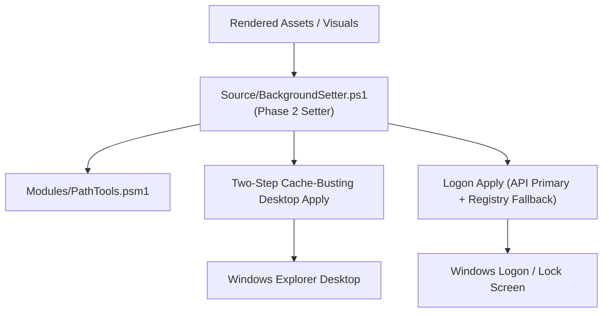

# App: 3 - Desktop & Logon Wallpaper Setter Architecture

### 1. Architectural Concept & End-User Perspective
App 3 manages the low-level Windows shell and display subsystem integration. It applies desktop wallpapers using a cache-busting refresh sequence (temporary path swap followed by final stable path) to overcome Windows Explorer wallpaper caching issues. For logon and lock screen backgrounds, it executes a two-tier strategy: primary Windows API apply with automated policy-registry fallback.

### 2. User Mental Model & Topology

---
