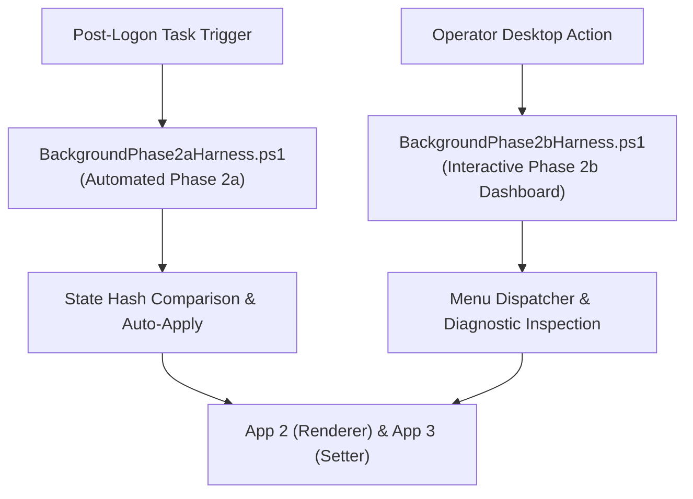

# App: 4 - Phase Execution Harness & Interactive Dashboard Architecture

### 1. Architectural Concept & End-User Perspective
App 4 provides the orchestration and user-interaction layer for BackgroundModifier. It isolates automated background execution from interactive operator flows:
- **Phase 2a Harness (`BackgroundPhase2aHarness.ps1`)**: Non-interactive, scheduled post-logon autorun that detects state changes and conditionally executes rendering and applying.
- **Phase 2b Harness (`BackgroundPhase2bHarness.ps1`)**: Interactive desktop dashboard with user-selectable actions (force refresh, update logon screen, inspect telemetry state, view logs) and immediate visual feedback.

### 2. User Mental Model & Topology

